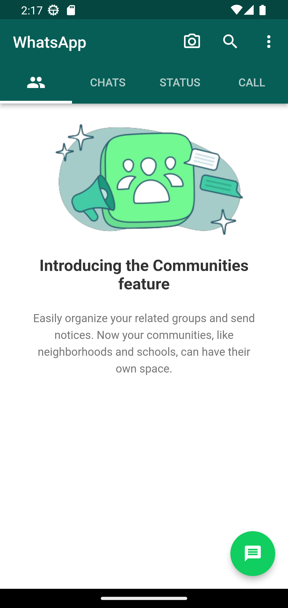
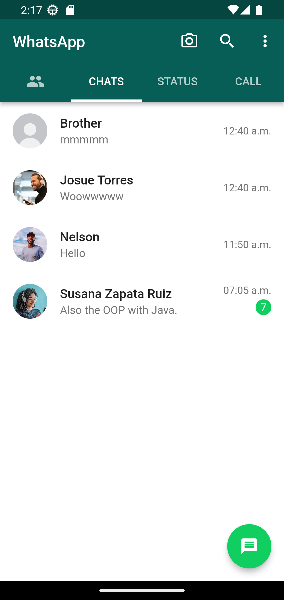
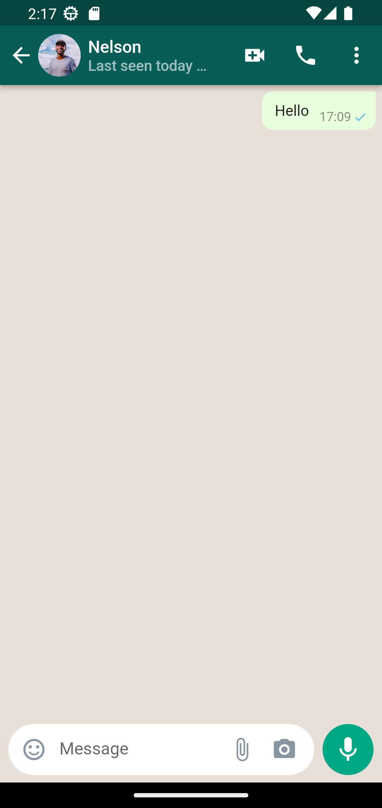
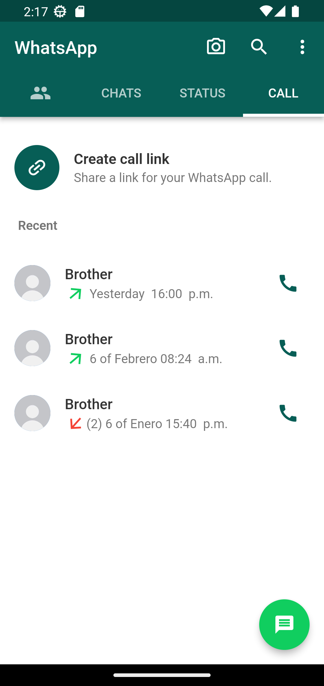

# WhatsApp clone
The cloned whatsapp graphical interface, developed with flutter.

## Development 

### Project structure
In the `assets` folder are all the files used by the application.

- **themes:** Files that contain the theme of the application.
- **screen:** The screen that the user can see.
- **widget:** They are like components, the screen folder depends on them.
- **models:** Models i use in data folder.
- **data:** I use it as a database in the application.


### My experience developing
- I had no complications with the development, I can say that it was easy. But it was a lot of fun, I had to think about how to simulate a database, about messages and contacts, that caused me some problems anyway, someday I'll have to make a Full Stack Mobile app.

### Technologies used in the project

1. [Flutter](https://flutter.dev/)
2. [Dart](https://dart.dev/)

## Demo 

You can see the app running, just open the terminal and enter the following commands:
```
git clone https://github.com/YerikAH/whatsapp-clone.git
cd whatsapp-clone
flutter run
```
### Screenshots






## Author

- Harvey Yerik

    - [Twitter](https://twitter.com/yerikhar)
    - [GitHub](https://github.com/YerikAH)
    - [Send Me A Message](https://yerikah.github.io/send-me-a-message/dist/)
